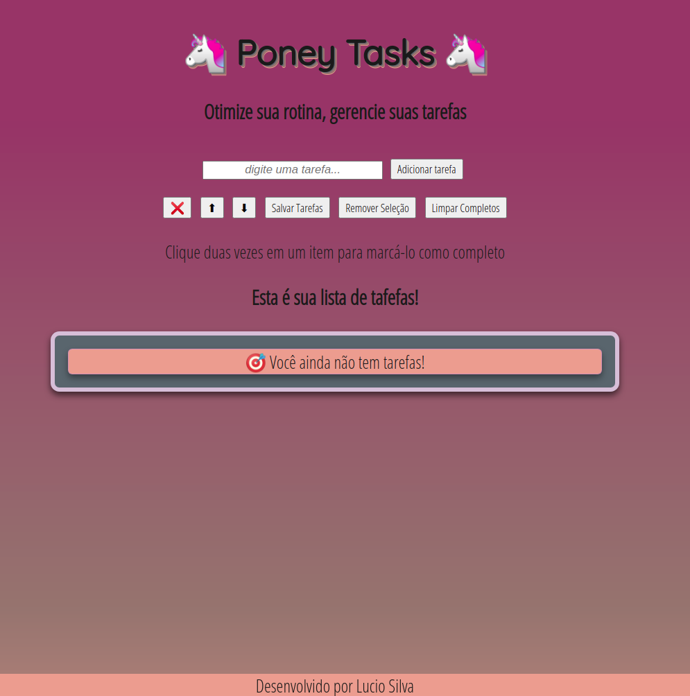

# To do List 🎯

Project to do list, developed as study material proposed by the [Trybe](https://www.betrybe.com)

### Objective

☑ DOM manipulation and elements.  
☑ Work and training the event capture with JS.

### Access

link ➡ [Pixel Art](https://lucioosilva.github.io/portfolio/projects/P3-Pixelart/)

### How to use

manage your tasks, add new tasks, mark completed ones and / or remove them! 🙆‍♀️  
Poney Tasks is here to help you! 🦄
 

 

#### More
My [portfolio](https://lucioosilva.github.io/portfolio)