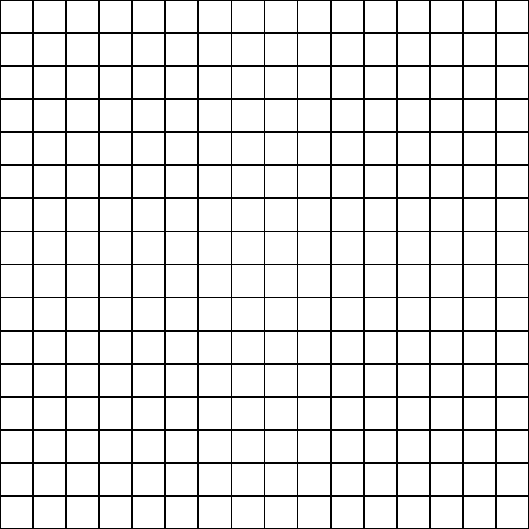

# Pixel Art 👾

Project pixel art, developed as study material proposed by the [Trybe](https://www.betrybe.com)

### Objective

☑ DOM manipulation and elements.  
☑ Work and training the event capture with JS.

### Access

link ➡ [Pixel Art](https://lucioosilva.github.io/portfolio/projects/P3-Pixelart/)

### How to use

Select the colors available in the palette that is randomly generated, if you don't find the color, just generate another palette! 🤸  
Release your creativity! 🚀

 

 

#### More
My [portfolio](https://lucioosilva.github.io/portfolio)
