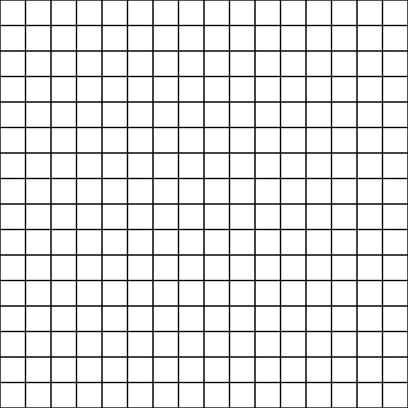

# Mystery Letter 📨

Project Mystery Letter, developed as study material proposed by the [Trybe](https://www.betrybe.com)

### Objective

☑ DOM manipulation and elements.  
☑ Work and training the event capture with JS.

### Access

link ➡ [Mystert letter](https://lucioosilva.github.io/portfolio/projects/P4-Mysteryletter/)

### How to use

Insert you phrase on input to write your letter. 👌  
The words will be created in different text styles! 🤸

 

 

#### More
My [portfolio](https://lucioosilva.github.io/portfolio)
